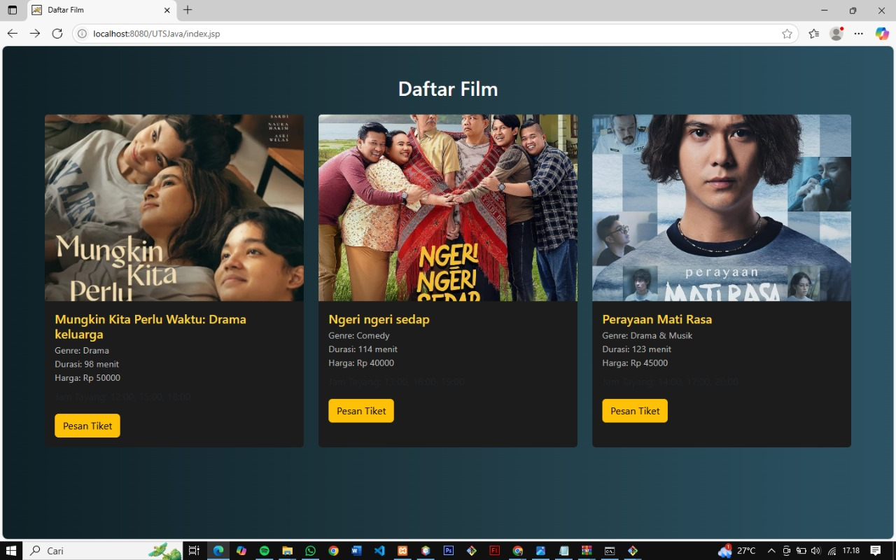
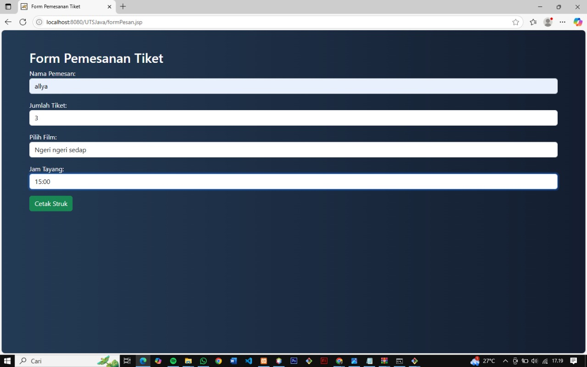
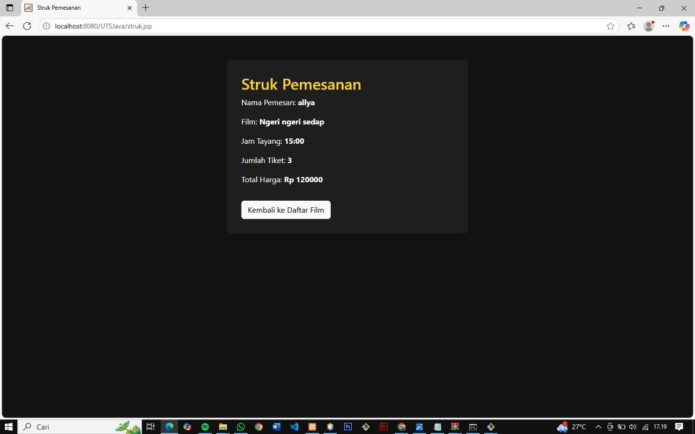

## Deskripsi
Aplikasi JSP sederhana untuk pemesanan tiket bioskop online (tanpa database). Pengguna dapat memilih film, jam tayang, dan jumlah tiket.

## Cara Menjalankan
1. Jalankan Apache Tomcat atau XAMPP.
2. Clone repository nya
3. Buka **NetBeans IDE**.
4. Pilih **File > Open Project** dan arahkan ke folder project `UTSJava/`.
5. Klik kanan project, lalu pilih **Run**.

## Hasil Output

## Teknologi
- JSP
- Java Core Library
- Bootstrap 5
